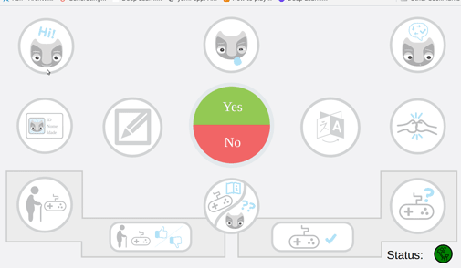

# vizzy_speech
Speech messages and ros software for Vizzy


## Screencapture of the speech interface
(Graphics designed by Hugo Simão)




## Using this package on the real Vizzy robot:

This package is already loaded with the main launcher. The web interface's link is bookmarked on Vizzy's laptop.


## Using this package at home:

1) You need to setup a google cloud account. Follow the steps in: https://cloud.google.com/text-to-speech/docs/before-you-begin
2) Put the credentials file in the "vizzy_speech/vizzy_speech_servers/credentials" folder and call it "google.json"
3) Change the IP address to the one of your roscore in https://github.com/vislab-tecnico-lisboa/vizzy_speech/blob/b1e15f464cfc577f83e3e63163c7cf9dc21555c4/vizzy_web_woz/js/button_events.js#L27 . If you are making tests locally you can just use the localhost (127.0.0.1).
4) Launch a simplified launcher with just the action server and rosbridge_websocket:

``
roslaunch vizzy_speech_servers liteWozSystem.launch``

1) Open the vizzy_web_oz/index.html file on your browser. We tested this on Google Chrome and the Brave Browser.


## If you want to edit the predefined utterances

Edit the files in vizzy_speech/vizzy_web_woz/js/lang_xx.js


## Using the action client from sofware

### Python

``` Python
#!/usr/bin/env python
# -*- coding: utf-8 -*-

from __future__ import print_function
import rospy


# Brings in the SimpleActionClient
import actionlib

import woz_dialog_msgs.msg

def test_action():


    client = actionlib.SimpleActionClient('gcloud_tts', woz_dialog_msgs.msg.SpeechAction)

    client.wait_for_server()

    goal = woz_dialog_msgs.msg.SpeechGoal(language="pt_PT", voice="pt-PT-Wavenet-D", message="Olá boa tarde", speed=2)

    client.send_goal(goal)

    client.wait_for_result()

    return client.get_result() 

if __name__ == '__main__':
    try:
        # Initializes a rospy node so that the SimpleActionClient can
        # publish and subscribe over ROS.

        rospy.init_node('speech_gcloud_client_py')
        result = test_action()
        print("Result:", result.success)
    except rospy.ROSInterruptException:
        print("program interrupted before completion", file=sys.stderr)

```


